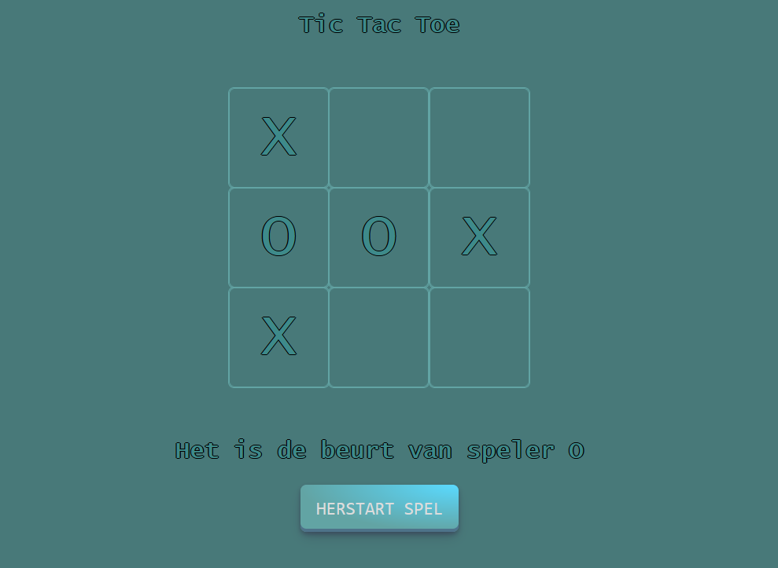

# Tic Tac Toe

Dit is een eenvoudig **Tic Tac Toe**-spel dat je kunt spelen in je webbrowser. Het is ontwikkeld met behulp van HTML, CSS en JavaScript.

## Hoe te spelen

1. Open het bestand `home.html` in je webbrowser.
2. Klik op de cellen in het speelveld om "X" of "O" toe te voegen.
3. Het spel controleert automatisch of er een winnaar is of dat het gelijkspel is.
4. Je kunt het spel opnieuw starten door op de knop "Herstart spel" te klikken.

## Voorbeeld

## Installatie

1. Clone deze repository naar je lokale machine.
2. Open het bestand `home.html` in je webbrowser.
